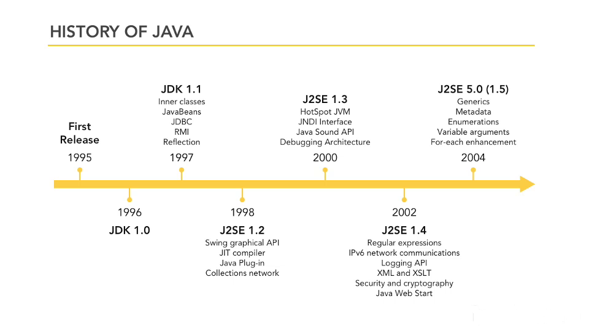
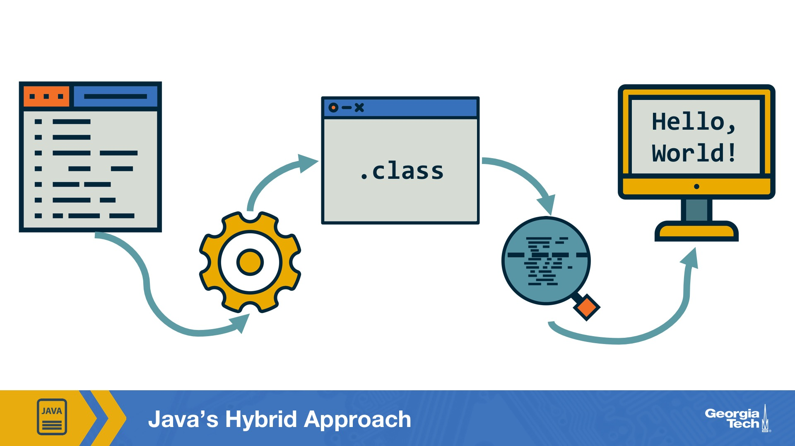

# Table of Contents
1. [Introduction to Java](#introduction-to-java)
    1. [Introduction to Java](#introduction-to-java-1)
    2. [Basic Elements of Java Programs](#basic-elements-of-java-programs)
    3. [Executing Java Programs](#executing-java-programs)
        1. [Compilers](#compilers)
        2. [Interperters](#interpreters)
        3. [So Why Ever Use Interpreters](#so-why-ever-use-interpreters)
        4. [Java's Hybrid Approach](#javas-hybrid-approach)
    4. [Java Development Kit (JDK)](#java-development-kit-jdk)
        1. [Installation](#installation)
        2. [Running Java Code](#running-java-code)
2. [Why Object-Oriented Programming](#why-object-oriented-programming)
    1. [Overview](#overview)
    2. [Running the Programs](#running-the-programs)
    3. [Shifting to Objects](#shifting-to-objects)
    4. [Benefits](#benefits)


## Introduction to Java

### Introduction to Java

Despite C and C++ existing, particularly C++ which is object-oriented, Java was created to be safer in order to deploy to devices.

Due to automatic memory management and other safety mechanisms, Java avoids many security and memory issues that C and C++ experienced.

Java grew in popularity as it filled the gap of needing dynamic content on early static websites.

Despite it's history, Java is still running today - reportedly on a few billion devices.



### Basic Elements of Java Programs

* Statements can be grouped together using a method
* A program must have at least one or more methods
* In order to be executable, a program must have a method called "main"
* Methods are enclosed in classes
* A program must have one or more classes

Here is an example Java program:

```java
// A simple program that prints text on the terminal
public class HelloWorld {
    public static void main(String[] args) {
        System.out.println("Our first Java program!");
    }
}
```

`//` denotes single-line comments

`public class` is a header that gives the class a name
* class names can't have spaces so we tend to use Camel Case

`public static void` this line denotes the starting point of the method
* In this case it is the first and only method in the class
* The main method is automatically executed when you run a Java program

To write the code into a file:
* file name must match the class name
* extensions must be ".java"
* in this case above, the file will be `HelloWorld.java`

### Executing Java Programs

In our example above the code is too high-level for a computer's processor to directly execute. We must convert this source code to machine code so that the processor can understand it.

#### Compilers

Compilers take programs written in a high-level language and translate it to a low-level language like machine code or something similar. 

This translation is done in 1 session and generates a new set of files.

Advantages:
* generally faster
* only needs to compile once
* Ex: C, C++

#### Interpreters

Translation happens at the same time the program is running with no intermediate files. Each statement is converted to machine code and executed 1 by 1 until the program stops.

* require translation each time
* Ex: Python, PHP

#### So why ever use interpreters?

Interpreters may be slower but the code will execute on any computer as long as there is a proper interpreter present. This is because there are no intermediate files.

The "instruction set" or type of machine code a processor understands may not be the same between manufacturers or even those made by the same manufacturer.

#### Java's hybrid approach



Java uses a hybrid approach to take advantage of compilation and interpreters.

Instead of it's source code being compiled to machine code (like C and C++) a compiler generates "bytecode" and stores it in files with a `.class` extension. Bytecode is not limited to specific processors instruction sets but are close to low level machine code.

Once the bytecode is generated it can be run using an interpreter that translates it into machine language of the target computer's particular processor. The translation costs in this case are not quite as significant because of how low-level the bytecode is.

This Java interpreter is usually referred to as the Java Virtual Machine (JVM). It is called a "virtual machine" because the compiled Java code is executed by software that interprets and performs the execution as opposed to the processor.

### Java Development Kit (JDK)

The JDK is software containing the compiler and interpreter. You may see Java Runtime Environment (JRE) in some places. This contains only the tools for executing code. This will not be sufficient since we will be writing, compiling, and executing programs.

It is important to note that the JVM is part of the JRE, which interprets, but the JDK actually compiles the code to bytecode.

#### Installation

Note that I am using Ubuntu in a WSL.

Download installation software:
```bash
sudo apt-key adv --keyserver hkp://keyserver.ubuntu.com:80 --recv-keys B1998361219BD9C9
sudo apt-add-repository 'deb http://repos.azul.com/azure-only/zulu/apt stable main'
```

Update the package list:
```bash
sudo apt-get update
```

Install JDK (version 11 in this case):
```bash
sudo apt-get install zulu11-jdk
```

Verify installation and version:
```bash
java -version
```

Output: `openjdk version "11.0.23" 2024-04-16`


#### Running Java code

The example code from earlier was turned into a java file [HelloWorld.java](programs/HelloWorld.java)

Compile the code:
```bash
javac HelloWorld.java
```

Notice this created `HelloWorld.class`

To initiate the Java interpreter and start execution:
```bash
java HelloWorld
```

You will see the output, for example `Our first Java program!` in the terminal.

## Why Object-Oriented Programming

### Overview

Let's create a slightly more complicated program.

```java
public class FahrenheitToCelsius {
    public static void main(String[] args) {
        int saturdayFahrenheit;
        int sundayFahrenheit;
        saturdayFahrenheit = 78;
        sundayFahrenheit = 81;
        double saturdayCelsius = (5.0/9) * (saturdayFahrenheit - 32);
        double sundayCelsius = (5.0/9) * (sundayFahrenheit - 32);
        System.out.println("Weekend Averages");
        System.out.println("Saturday: " + saturdayCelsius);
        System.out.println("Sunday: " + sundayCelsius);
    }
}
```

`FahrenheitToCelsius` is the class name provided in the class header. This is a Java identifier.

Identifier rules:
* can contain letters, digits, underscores `_`, dollar signs `$` 
    * i.e. HelloWorld! cannot be used
* digits cannot be the starting character 
    * i.e. 1celsius cannot be used
* cannot be a reserved word - note that reserved words are all lowercase. This is important because Java is case sensitive

In the body of the method `main` you will see variables being introduced.

A variable is a place in memory that stores some value. Variables have names (identifiers) so that you can properly refer to their value and location in the code.

**It is a Java standard to use Camel Case for variables.**

Java associates a specific set of values with a **type**

|type|size|range|
|:--:|:--:|:---:|
|byte|8 bits|-128 to +127|
|short|16 bits|-32,768 to +32,767|
|int|32 bits|-2,147,483,648 to +2,147,483,647|
|long|64 bits|-9E18 to +9E18|

Variables are declared using a **Variable Declaration Statement**:

`<type> <identifier>;`

**Java is statically typed, so a variable must be declared before it can be used.**

Variables are assigned a value using a **Variable Assignment Statement**:

`<identifier> = <expression>;`

The `=` in this case is a **Simple Assignment Operator.**

**The type of a variable must be compatible with the type of the value being assigned to it.**

In the line `double saturdayCelsius = (5.0/9) * (saturdayFahrenheit - 32);` you can see the variable was declared and assigned in a single line.

`(5.0/9) * (78 - 32)` We use **double** because it will handle the decimal.

**String literals must be enclosed in quotation marks "" as you can see in the `System.out` statements**

### Running the programs

[FahrenheitToCelsius.java](programs/FahrenheitToCelsius.java)

```bash
javac FahrenheitToCelsius.java
java FahrenheitToCelsius
```
Output:
`
Weekend Averages
Saturday: 25.555555555555557  
Sunday: 27.222222222222225  
`

### Shifting to Objects

Imagine we want to add many other features to this code.

i.e. workday weather, highs and lows, humidity

This could be considered building a comprehensive daily forecast model.

If we wanted to scale this out to a weeks worth of daily forecasts this can be done with little work if we utilize a blueprint for the daily forecast. 

**Object-oriented programming maintains that you can use code to model entities, concepts, and processes in ways that effectively simplify the task of building, maintaining, and extending software.**

**The attributes of an object collectively represent its state, and the actions make up its behavior.**

### Representing Objects

For example, let's think about a car. While it is a physical object in the real world it can also be a program object like a car in a video game.

Attributes:
* color
* make
* model
* year
* current speed

Actions:
* braking
* turning
* accelerating

Earlier we mentioned classes are groups of enclosed related methods. As we see now they also define the state and behavior of a kind of object using attributes and methods.

**You can manipulate an object by calling one or more of its methods.**

For example, running the `accelerate` method on a car class can change it's `current speed` attribute.

**Each object that's created from a class has its own copy of the class's state variables.**

For example Monday's temperature can differ from Tuesday's etc.

### Benefits

Think about maintaining software including patching bugs, adding features, etc.

What if we wanted to add a daily pollen count to our weather forecast program?

Since we already have a class for daily forecast we can simply declare a new state variable i.e. `pollenCount`. 

Remember that after the program has been updated the Java code must be re-compiled to generate a new `.class` file. 

While we are looking at object-oriented programming, other paradigms do exist. One is called **procedural programming** which is essentially just a collection of methods. This can work for smaller programs but can become difficult to work with as complexity increases.

