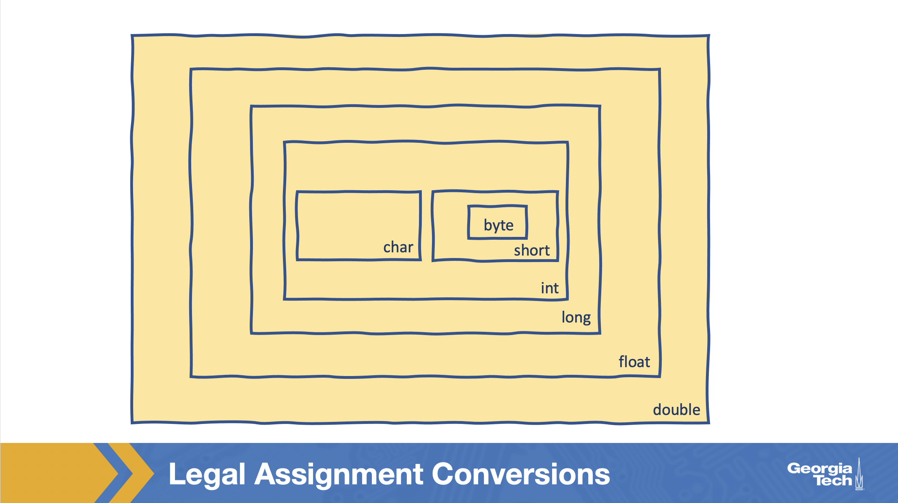
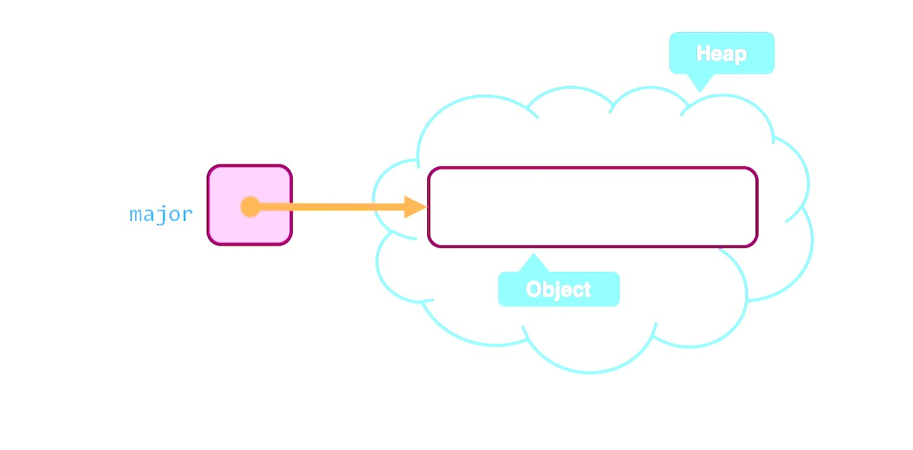

# Table of Contents
1. [Back to Basics](#back-to-basics)
    1. [Whitespaces](#whitespaces)
    2. [Errors](#errors)
        1. [Compiler Errors](#compiler-errors)
        2. [Runtime Errors](#runtime-errors)
        3. [Logical Errors](#logical-errors)
    3. [Comments](#comments)
    4. [Variables and Constants](#variables-and-constants)
    5. [Primitive Types](#primitive-types)
    6. [Arithmetic Expressions](#arithmetic-expressions)
    7. [Integer Division](#integer-division)
    8. [String Arithmetic](#string_arithmetic)
    9. [Mixed Type Expressions](#mixed-type-expressions)
    10. [Assignment Conversion](#assignment-conversion)
    11. [Casting](#casting)
2. [Using Predefined Classes](#using-predefined-classes)
    1. [Primitive Types vs. Classes](#primitive-types-vs-classes)
    2. [Declaring Variables](#declaring-variables)
    3. [Instantiation](#instantiation)
    4. [Invoking Methods](#invoking-methods)
    5. [Reference Variables](#reference-variables)
    6. [String Methods](#string-methods)
    7. [toLowercase](#tolowercase)
    8. [concat ( and Pass by Value)](#concat--and-pass-by-value) 
    9. [replace](#replace)
    10. [substring](#substring)
    11. [Other String Methods](#other-string-methods)
3. [Input and Output](#input-and-output)

## Back to Basics

### Whitespaces

Blanks, tabs, and newline characters that help provide separation.

Take a look at some previous code we wrote:

```java
// A simple program that prints text on the terminal
public class HelloWorld {
    public static void main(String[] args) {
        System.out.println("Our first Java program!");
    }
}
```

The whitespace between separating words is all actually "extra". The code will still compile. But, the extra whitespacing helps improve readability.

```java
// A simple program that prints text on the terminal
public class HelloWorld {
public static void main(String[] args) {
System.out.println("Our first Java program!");}}
```

### Errors

3 types of errors:
* compiler
* runtime
* logical

**Note semantics represents the meaning of some code.**

Just because code is syntactically correct, it is not semantically correct. That means just because it compiles does not necessarily mean it works or does what you expect it to. 

Errors are essentially getting either syntax or semantics wrong (or both).

#### Compiler Errors

**Compilers check syntax not semantics.**

For example removing a space between words when assigning a variable.

The error will have the name of the Java file and the line number with that error.

Then there will be an error description such as `connt find symbol`.

#### Runtime Errors

Even if you got the syntax right there could still be an error as runtime due to semantics.

For example `int x = 5/0;`.

The error message will contain a list of the statements and methods that were active when the error occurred. This is referred to as a **stack trace**.

#### Logical Errors

Caused when there are mistakes in the program's semantics.

For example, entering the wrong mathematical operator when writing a formula in the code.

In this case there is not necessarily a useful error produced. Because of this you should incrementally test programs as you build them and not wait until you have written large complex code.

**Compiling and testing after each class and method is good practice.**

### Comments

**All comments are ignored by the compiler.**

Java has 3 types of comments:
* Line comments
* Block comments (multi-line)
* Javadoc comments

**Line comments** are dictated by `//` for example:
```java
//line comment
```

**Block comments** are dictated by `/* and */` for example:
```java
/*
block
comment
*/
```

**Javadoc comments** are automatically created by Java scanning source code for comments and creating a nicely formatted HTML file describing your code. They are dictated by `/** and */`.

### Variables and Constants

One method cannot see the variables declared inside another. You will receive a **cannot find symbol error**. A variables scope is within the closest set of braces `{}`.

We looked at assigning variables earlier such as `double PI = 3.1415926`.

But what if we don't want the variable to change later?

`final double PI = 3.1415926` will prevent any changes later. In this case instead of calling it a variable we call it a **constant**.

Trying to re-assign the constant will result in a compilation error, for example:

```java
public class ConstantTest {
    public static void main(String[] args) {
        final double PI = 3.14159265359;
        PI = 3.14;
    }
}
```

### Primitive Types

The most basic types of data that are built into the Java language. Each have their own reserved word. There are 8 primitive types.

* byte - integer based
* short - integer based
* int - integer based
* long - integer based
* float - real number values
* double - real number values
* char - individual characters
* boolean - logic based values

| TYPE   | SIZE      | RANGE                                                        |
|--------|-----------|--------------------------------------------------------------|
| byte   | 8 bits    | -128 to +127                                                 |
| short  | 16 bits   | -32,768 to +32,767                                           |
| int    | 32 bits   | -2,147,483,648 to +2,147,483,647                             |
| long   | 64 bits   | -9E18 to +9E18 (approximately)                               |
| float  | 32 bits   | approximately -3.40282347E+38 to +3.40282347E+38 (6-7 digits of precision) |
| double | 64 bits   | approximately -1.79769313486231570E+308 to +1.79769313486231570E+308 (15-16 digits of precision) |

For integers the default type is **int** and for floating point numbers the default type is **double**.

Let's look at an example of assigning a large integer `99,999,999,999` which is larger than the default int allows.

`long reallyBigNumber = 99999999999;` would fail at compilation.

`long reallyBigNumber = 99999999999L;`is appropriate and defaults the default type.

Similarly with floats:

`float fraction = 0.1331;` is illegal because remember floating point defaults to **double** and not **float**.

`float fraction1 = 0.1331F;` is legal.

**You can also use lowercase to override i.e. `f` but it is not recommended**

You can also use `D` numeric literal. Remember before this code:

`double saturdayCelsius = (5.0/9) * ...`

We used `5.0` instead of `5` to avoid error since this variable is **double**. We could have also done the following:

`double saturdayCelsius = (5D/9) * ...`

The **char type** represents individual characters. 

Because characters do not necessarily follow a semantically logical order we refer to a collection of characters as a **set** and not a **range**. 

There are various **character sets** such as ASCII. Java uses a superset of ASCII called **Unicode**.

Assigning **char**:

`char space = ' ';`

`char yes = 'Y';`

**Double quotes are used for strings only, chars must be wrapped in single quotes.** But what if there is a single quote inside a string? In this case you need to use an **escape sequence** followed by a **descriptor** for example `'\''`.

Escape sequences:
* `\t` - tab
* `\n` - new line
* `\r` - carriage return
* `\\` - backslash
* `\"` - double quote
* `\'` - single quote

`"For \"Quotes inside quotes\", make sure to use the quote escape sequence"`

**Boolean** can only have 2 possible values, `true` or `false`.

### Arithmetic Expressions

An **expression** is a combination of operators, operands, or method calls in a single Java statement. The expression must evaluate to a single value.

|operator|symbol|
|--------|------|
|addition|+|
|subtraction|-|
|multiplication|*|
|division|/|
|remainder (modulus)|%|

### Integer Division

In Java dividing 2 integers leaves off the decimal with no rounding.

`9 / 2 = 4` as opposed to 4.5

If you ensure a floating point as either the numerator or denominator decimals will be added. 

`9.0 / 2 = 4.5`

LIkewise you can append `F` or `D` to either the numerator or denominator.

`9 / 2D = 4.5`

### String Arithmetic

Adding strings simply concatenates them in Java.

`"13" + "31" = "1331`

### Order of Operations and Precedence

In the case that there are multiple operators and operands Java goes left to right via the algebraic order of operations.

`1331 + 1 / 3 = 1331`

In this case `1 / 3 = 0` and `0 + 1331 = 1331`

Just as in algebra, you can use parenthesis to force precedence.

### Mixed Type Expressions

An expression with operands of the same type will have a result of that type.

Something called **promotion** occurs with certain mixed type expressions.

`1331.0 / 4.0 = 332.75`

`1331 / 4 = 332`

`1331.0 / 4 = 332.75`

Adding anything with a string results in a string through promotion.

`"13" + 31 = "1331`

`'1' + "1331" = "13311"`

`false + "" = "false"`

### Assignment Conversion

**Promotion** above is an example of type conversion. There are 2 others **assignment conversion** and **casting** which we will go over now.

Just as in **promotion**, **assignment conversion** happens automatically.

In this case it occurs during a variable assignment as opposed to in an expression.

`int average = 4;`

`double gpa = average;`

Above gpa = 4.0 and average = 4.

`double average = 4.0;`

`int gpa = average;`

ERROR: incompatible types (compiler error)

This error does not occur because of the bits size it occurs due to the range limitation. For example double has the largest possible range while int is much smaller.

int can easily be converted to long, byte can easily be converted to short for example.

Even long can be converted to float.



### Casting

In some cases you want to force a conversion with an operator. This is called **casting**. 

`5 / 9` we can bypass integer division in this case via casting `(double)5 / 9`. In this case through **promotion** this will essentially act as `5.0 / 9.0`.

Of note, parenthesis and order of operations is important here.
`(double)(5 / 9) = 0.0` In this case 5/9 integer division occurs resulting in 0 which is casted to double 0.0.

**Note that casting does not just apply to numeric types, we will go over this later in the course**

## Using Predefined Classes

Here we will discuss some of the common pre-defined classes that are a part of java.

### Primitive Types vs. Classes

Java Classes are types that can have values that are more than just a single data element. This is unlike primitive types.

### Declaring Variables

Declaring variables of objects follows the same rule as primitive types.

We saw how to declare and assign variables of primitive types previously:

`<type> <identifier>`

`<identifier> = <value>`

Since objects are more complex than primitive type value their data is stored in a separately managed part of memory cvalled the heap.

So `int saturdayFahrenheit'` stores an actual int value.

`String major;` stores an *address to a String*.



### Instantiation

The process above of creating an object is called **instantiation**.

Of course there can be multiple instances of a single class.

`new ClassName(parameters)`

When you create a new instance of a class like above, it calls a special method of the class called the **constructor**.

For example:

`String major;`

`major = new String("Computer Science");`

An address in the heap for "Computer Science" is now assigned to major.

Because strings are so common you can bypass these extra terms in Java like we have done previously.

`String major = "Computer Science";`

### Invoking Methods

Earlier we did the following:
`System.out.println("Hello,World!");`

The Java Standard Library has over 4000 classes.

Standard Library:
* System
* String
* PrintStream
* 4000+ others

The standard library is 1 of the 4 major components of Java:
* API (Standard Library)
* Syntax
* Compiler
* JVM

`identifier.methodName(parameters)`

`major.length()`

Returns 16

**Saying a method has returned means that it has finished executing without an error.**

No particular object owns a method of it's class. There is 1 length() method for example but it can be applied to many different string objects.

### Reference Variables

`double gpa = 4.0;`

gpa = 4.0

`double average;`

`average = gpa;`

average = 4.0

Value in `gpa` is copy and stored in `average`.

`String major = new String("Computer Science");`

* Creates string object and `major` points to it

`String interest;`

* Finds a storage location to hold a string object but it is not yet initialized

`interest = major;`

* Initializes the string object

In this case `interest` gets a copy of the ADDRESS of the string.

**When two variables point to the same object, they are called alises**

`major.length();` == `interest.length();`

Now this is important because changing on object for 1 of the aliases changes it for all of the others.

What if now `interest` and `major` were changed to "Long walks on the beach" from "Computer Science"? 

If nothing is pointing to "Computer Science" it is removed through an automatic process called **garbage collection**. 

### String Methods

We looked at length(), but there are many other String object methods.

* toLowerCase()
* concat(String)
* replace(char, char)
* substring(int, int)

Above are method **signatures** which consists of a method's name and a representation of the type and position of each parameter.

You can invoke a string method using a reference variable or a string literal itself.

`interest.toLowerCase()`

`"Computer Science".toLowerCase()`

The variable or value to the left of the period is called the **calling object**.

### toLowerCase

`String toLowerCase()`

`String interest = "Long Walks on the Beach";`

`interest.toLowerCase();`

Return value: "long walks on the beach"

A new string object is returned. The calling object is not actually changed by the method.

**Strings are immutable**

### concat ( and Pass by Value)

`String concat(String str)`

It has not been mentioned yet but above `str` is a **formal parameter** which is a variable that is listed in a method header and will be assigned to a value before the method's statements are exectuted.

Not ethat the `+` operator can be used as shorthand for concat.

`major + interest` is the same as `major.concat(interest)`

In this case above `interest` represents an **actual parameter** which represents the value that is actually assigned to a method's formal parameter.

Let us discuss **formal parameters** and **actual parameters** further. `major.concat(interest)` in this case `interest` is the **actual parameter**. Just before Java begings executing the statements of any method, if that method has formal parameters, the value of each actual parameter is copy and assigned to the corresponding formal parameter. This is called **pass by value**.

So in this case above `interest` is assigned an alias `str` since an address is ultimately the value that is copied. Then `concat` uses the newly copied address in `str` to access to the contents of the string to append.

The return value: "Computer Sciencelong walks on the beach"


### replace

`String replace(char oldChar, char newChar)`

### substring

`String substring(int beginIndex, int endIndex)`

### Other String Methods


## Input and Output

